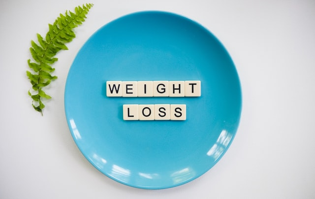

En écoutant un podcast sur l'écriture "Écrire sans ratures", j'ai eu une révélation sur un concept psy dont je ne connaissais pas l'existence : "la dissonance cognitive". Moi qui voulais savoir comment m'affranchir de ma légitimité d'écrire ou encore de ma procrastiantion plus que latente (dont sur ce blog...*no comment*), je me retrouve à prendre conscience d'un problème tout autre. Alors *Kézako* ? Pour résumer le truc très simplement c'est quand votre croyance profonde n'est pas du tout raccord avec vos gestes. Exemple grossier mais réel : je ne supporte pas qu'on fasse de mal aux animaux mais j'adore le foie gras. Voilà. Alors cela peut paraître normal aux premiers abords. Mais cela à de graves conséquences sur le long terme. On ne peut jamais être aligné coeur-corps-esprit. 

Et c'est là que j'ai fait le parallèle avec mon poids/sport inefficace. Malgré mes efforts depuis plusieurs mois pour faire du sport plus régulièrement et manger correctement (enfin plus ou moins haha #cqfd). J'ai l'impression de faire les choses bien, de mieux manger malgré tout. Et pourtant, résultat sans appel. Je ne maigris pas. Je regrossis presque. Et c'est un cercle vicieux. Et ce que j'ai compris c'est que je n'ai que des schémas de pensées et des croyances erronées. "Si je mange trop je vais grossir" Ou encore de manger des légumes verts alors que je n'aime pas ce que je mange. Je n'aime pas faire du sport non plus. Donc je fais quelque chose parce qu'il faut que je le fasse mais je ne me fais pas plaisir et en plus je le fais tout en croyant que ça ne change rien à ma morphologie. Mes croyances ne sont pas en adéquation avec mes actes. *Psyyyyyychooo* 

Je me suis donc intéressée au sujet, lu, regardé des vidéos et lu des articles qui traitaient du sujet. J'avais déjà entendu parlé des kilos émotionnels mais comme le reste, je l'ai mis dans un coin de ma tête. Sauf qu'aujourd'hui je pense que c'est une réalité. Je suis stressée beaucoup plus facilement qu'avant avec la librairie. Je n'aime pas le contact client ou du moins peu. Je sais d'avance que je vais préférer être à la librairie de mangas et plus aux sauterelles. J'ai plus de plaisir à lire des mangas ou même BD que des albums. C'est ma vraie passion. Je n'arrive pas à dire que je regrette car je préfère malgré tout ma vie maintenant. Bref, je m'éloigne du sujet. J'ai perdu la boxe et Ludo c'est vrai, c'est quelque chose qui me manque beaucoup. Je fais un peu de sport mais rien à voir avec avant, je bossais vraiment tout. Là ce sont de petites séances de 30mn c'est tout. J'ai l'impression que mon corps ne veut plus perdre de poids alors que moi c'est tout ce que je désire. J'enfouie mes émotions de plus en plus. La seule qui survit c'est la colère, l'énervement. Pourtant je n'ai pas l'impression d'être malheureuse. Suis-je une dépressive qui s'ignore ? Tout ça pour dire que mon esprit n'a pas l'air d'être prêt à lâcher l'affaire pour que mon corps réagisse positiviement et qu'il se déleste des derniers kilos qu'il doit perdre pour se sentir bien. Ou alors c'est un message pour me dire que j'ai d'autres combats plus intelligent à mener ? 

J'ai donc vu une diétécienne aujourd'hui, j'ai besoin d'aide. D'une professionnelle. On va tenter une dernière fois quelque chose, peut-être qu'avec une approche plus psychologique car en fait tout mon problème de poids a toujours été que là : dans ma tête.

*To be continued*	