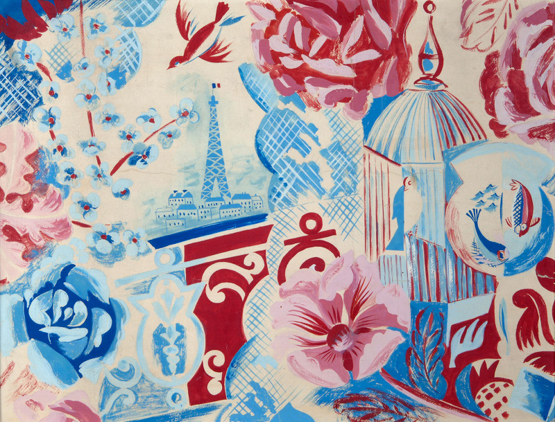
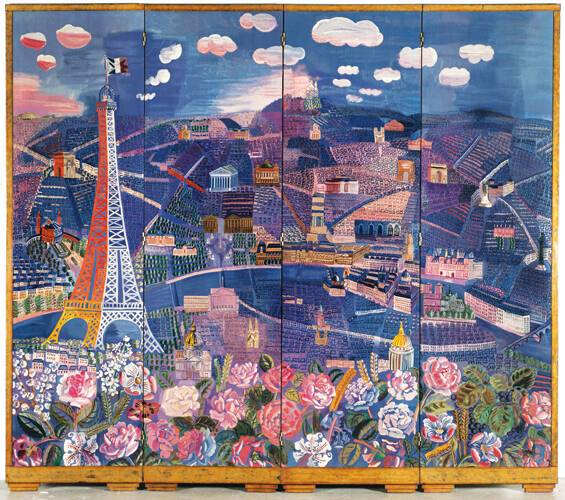
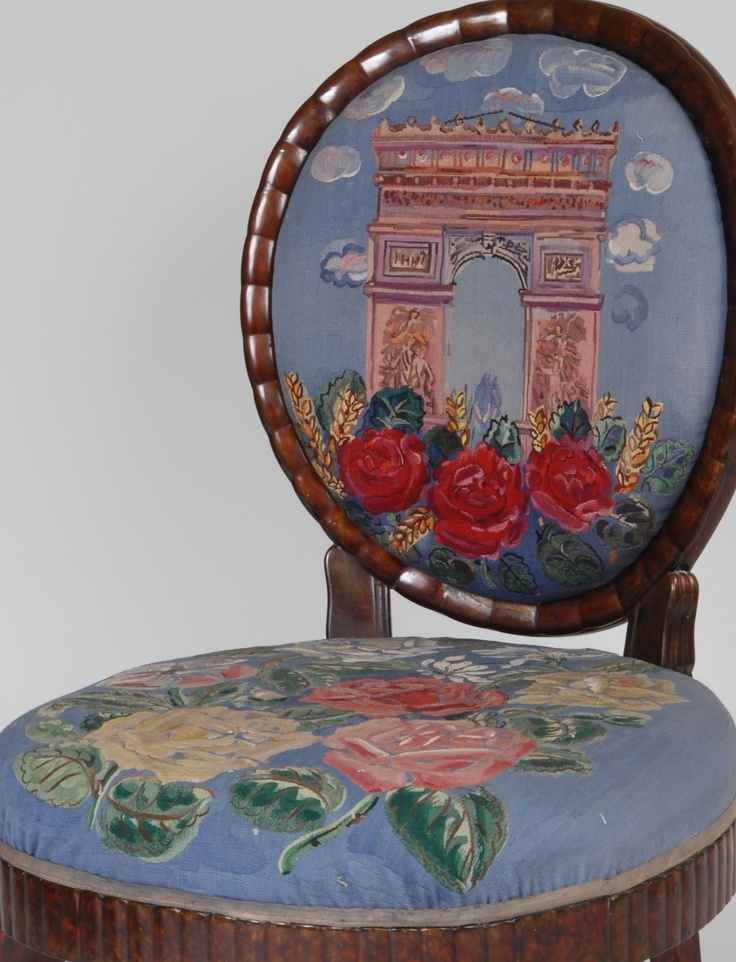

« Le Paris de Dufy » - exposition au Musée de Montmartre. *L’avis d’une non initiée en art.*

Rares sont les affiches d’exposition qui m’interpellent dans le métro. Mais celle du « Paris de Dufy » où sa vision de Paris avec de belles fleurs, des tons bleus chauds et bien évidemment roses, ont fini de me convaincre d’aller faire un petit tour à cette expo. C’était noté dans un coin de ma tête et bien évidemment je trouvais toujours une excuse pour ne pas y aller (= la flemme). *In extremis*, j’ai réussi à me mouvoir le dernier jour, et ce fut une très bonne décision. J’ai adoré cette exposition du début à la fin.

C’était une première pour moi ce petit musée de Montmartre, et ce matin-là j’avais voulu m’y rendre à pied de chez moi pour faire fonctionner ce qui me sert de jambes après des fêtes **foiegratesques**. Je me souviendrai de cette ascension à en perdre mes poumons puisque le musée est bien évidemment situé en haut de la butte de Montmartre.

Mon souffle retrouvé, ce fut une très belle surprise pour ce joli bâtiment qui se compose aussi de très beaux jardins, nommés après Monsieur Renoir. Avant qu’il ne devienne musée, cet endroit était un atelier d’artistes peintre ou plusieurs se sont succédés. On peut même visiter l’atelier tel quel, on pourrait presque sentir encore l’odeur de la peinture qui vient d’être déposée. La vue sur Paris est magnifique, une véritable petite bulle hors du temps. Je pense qu’y aller au printemps/été doit être beaucoup plus intéressant que d’y aller sous la pluie début janvier comme moi… 

Début de l’exposition. Je n’avais aucune idée de qui était ce Dufy, Raoul de son prénom.

Hélas, comme toutes les expositions que je fais, je lis ce qui écrit sur les panneaux explicatifs et j’oublie ce que je viens de lire quasi instantanément. Pour une raison inexpliquée (concentration de moineau ?) je ne retiens jamais rien des expositions. C’est toujours écrit de manière un peu pompeuse avec des mots à réveiller les morts que seule l’élite « parisienne » peut comprendre, *of course*. Et comme je ne comprends pas grand-chose – et que ça ne m’intéresse pas plus que ça dans le fond… - j’oublie. 

Bref, pour situer juste le monsieur, il est né en 1877 et décédé en 1953. Ce qui m’a beaucoup plu dans son travail c’est qu’il a touché un peu à tout et surtout à des techniques d’impression que j’aime particulièrement comme la lithographie. C’est une technique toujours actuelle et utilisée par les sérigraphistes, où le concept est grossièrement celui du tampon encreur. Sur une grosse gomme, les artistes dessinent puis gravent la gomme en enlevant toutes les parties que ne sont pas le dessin pour ne laisser en relief que la forme. Ainsi quand elle sera encrée sur le support final, seule la forme dessinée au préalable ne ressortira. On peut réaliser de très beaux travaux (j’en ai déjà fait, c’est très sympa juste tellement long à graver que je n’ai pas continué. Êtes-vous surpris ? Moi non plus.)

Il a donc réalisé beaucoup de petites lithographies notamment pour des livres. J’ai pu en voir pour le livre « Le Bestiaire » de Guillaume Apollinaire, grand poète. J’aimerais beaucoup me procurer cette édition mais étant tirée à l’époque à seulement 400 exemplaires, je doute fort de la retrouver un jour sur mes étagères. Je ne comprends pas pourquoi d’ailleurs elles n’ont pas été reproduites sur les éditions actuelles en livre de poche, mais passons. 

L’exposition est très bien fournie et fourmille d’essais, de dessins préparatoires, estampes. Moi qui suis difficilement transporté par les peintures en général, je n’éprouve pas forcément d’émotions, juste du pragmatique. Je reconnais le talent artistique des peintres mais au bout du 36ème Jésus dans les bras de la Vierge, on est vite lassé. Et chez Dufy ce qui m’a marqué c’est sa simplicité sophistiquée (vous noterez le magnifique oxymore) : « s’il a pu faire ça, je peux faire quelque chose aussi ». Je m’explique. Non, je ne sais pas dessiner et je n’ai clairement pas son niveau et la prétention de pouvoir reproduire la moindre de ses toiles. Cependant, la simplicité de ses traits, m’ont fait ressentir que ce n’était pas ça le plus important dans son œuvre, mais toute la gestion des couleurs. Les visages, les corps sont de simples courbes, formes qui n’ont rien de réalistes comme on peut avoir l’habitude de voir, mais toute la force se dégage des jeux de lumières et des pigments choisis. « Balcon de Paris » où l’on voit la tour Eiffel, des oiseaux, des fleurs, des poissons est superbe. Pourtant rien dans la perspective n’est correct et pourtant le rendu final est beau. Les couleurs sont vives et chaudes. On aurait envie que de notre balcon on puisse aussi admirer cette vue et voir ces couleurs (ai-je préciser que les dominantes de la toile étaient bleu, rouge et rose ?). 

On ressent son amour pour Paris à travers de nombreuses toiles, et même sur un paravent. Pour la commande d’un riche monsieur, il a peint sur un paravent de 2m30 de haut sur 2m60 de large une superbe vue de Paris où l’on peut admirer la tour Eiffel, le Sacré Cœur, Panthéon, arc de Triomphe, bref, tous les monuments célèbres de Paris. Il a réalisé une infinité de petites maisons pour donner cette impression d’immensité, et c’est très réussi. L’objet est sublime.

Il s’est également donné comme challenge de redonner une vie à de vieilles chaises types Louis XIV que nous avons tous vu chez grand-mère en peignant sur chacune d’entre elles un monument de Paris. L’assise était plutôt fleuri et le dos peinte du monument. Le travail ne fût pas évident, surtout de dessiner sur du tissu et un cadre arrondi. Le résultat est pourtant remarquable. 

Ce fut donc une très belle découverte, aussi bien du lieu en tant que tel (un autre bâtiment abritant l’exposition permanente de l’histoire du quartier de Montmartre comme la Commune par exemple mais aussi la naissance du Moulin Rouge et des grands lieux prisés au début du XXème siècle avec le Chat noir, et toutes ses affiches, superbe !). Mais aussi du monsieur Raoul Dufy qui était un artiste complet et qui a réussi à m’émouvoir.