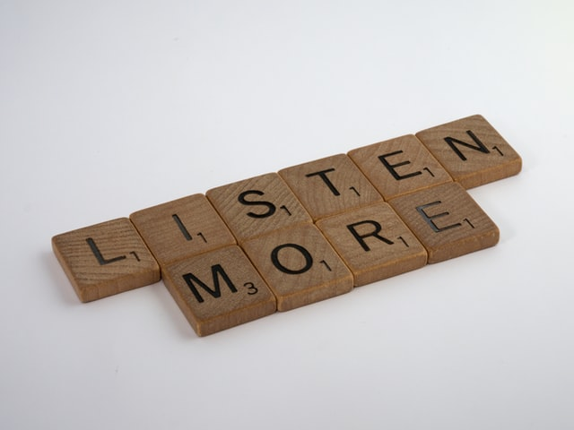

Ce que je trouve fascinant c'est que la nature nous a doté de deux organes formidables que l'on nomme communément "oreilles" et pourtant on ne s'en sert qu'à moitié. Vous savez ces deux petites choses à gauche et à droite au mileu de votre crâne ? Ce qui vous sert à écouter de la musique ou à pouvoir entendre une conversation. Mais saviez-vous aussi qu'elles servent à écouter les autres ? *Mais c'est qu'elle nous prendrait pour des idiots la dame !* 

Des idiots non, des personnes égoïstes oui. J'ai pu remarqué que très peu de personnes possèdent la qualité de l'écoute. Écouter, ce n'est pas écouter cinq minutes un.e ami.e se plaindre de ses problèmes, secouer la tête et lui dire "je comprends, je sais ce que tu ressens". Non vous ne savez pas, vous ne le vivez pas. Selon Goethe "**Parler est une nécessité, écouter est un art.**"

Oui vous écoutez quand quelqu'un vous parle, mais ce n'est que le son que vous écoutez, mais vous n'entendez pas. Ce que l'autre vous dit, vous confie. Analyser, comprendre et surtout ne pas juger l'autre pour ce qu'il est en train de vous dire, c'est un début de réel écoute. C'est être vraiment disponible pour la personne avec laquelle on parle. Prendre du temps à vous pour le donner à quelqu'un qui en a besoin. La genèse de tout cet article, c'est que pas plus tard qu'hier, on m'a fait le reproche de ne pas raconter mes problèmes et que cette personne était "là" pour m'écouter, qu'elle entendait ce que je lui disais. Mais c'est faux, archi-faux. Pas une seule fois, je n'ai été vraiment écouté car si cela avait été le cas, une discussion constructive et une ébauche d'aide au problème aurait pu être trouvé, mais non rien. "Je suis au courant de tes problèmes d'insomnie, je l'ai bien en tête". Ah oui ? Vraiment ? M'as-tu seulement écouté quand je te disais que j'étais vraiment fatiguée ? Que j'avais des envies parfois de me fracasser le crâne contre un mur pour m'endormir ? Réponse : "Faut arrêter de stresser la nuit hein". Merci de ce conseil, je vais mieux dormir cette nuit, c'est certain. Donc non, tu ne sais pas écouter les gens, tu aurais entendue ma détresse et tu aurais fait quelque chose (à moins que tu t'en contre fiche et cela est un autre débat haha). 

L'écoute développe l'empathie, et sans jamais s'approprier les tracas, essayer à son échelle de comprendre et de voir pourquoi ces émotions en particulier ressurgissent et de les comprendre. Rien que de savoir que l'autre se préoccupe réellement de vous, la conversation a un effet bénéfique. On est d'accord qu'il n'y a aucun miracle, mais une simple écoute sincère fait toute la différence. Il n'y a pas que les psys qui ont cette faculté (et encore !), nous tous nous pouvons la développer. Il faut juste arrêter de s'auto-centrer. Ce qui moi me paraît naturel, c'est une chimère pour les autres. Je pense que si l'écoute était quelque chose d'inné chez beaucoup de personnes, je ne serai pas comme je suis actuellement. A être fermée comme une huître et à lâcher les informations me concernant au compte goutte et surtout à qui, j'estime (oui j'ai mon ego !) faire confiance et ne me jugera pas. 

Ce qui est "drôle" aussi, c'est que nous avons l'écoute au sens primaire du terme avec nos deux oreilles mais il y a aussi l'écoute de soi. Savoir suivre son instinct, écouter ce que son corps nous dit, réclame. On ne s'écoute pas nous-mêmes, alors pourquoi écouter les autres ? Pourtant on la possède tous, cette petite voix. Combien de fois, on a pu se dire "je le savais, je l'ai senti ou encore j'aurai dû m'écouter". Et oui, ça nous arrive tout le temps et pourtant on n'apprend pas la leçon. On ne s'écoute pas. Pourquoi ? J'aimerais avoir la réponse à cette question. De par mon vécu et vie perso, je dirai que c'est un manque de confiance en moi criant. Si je ne me fais pas confiance, pourquoi écouter ce qu'un potentiel instinct pourrait me dire ? Logique mais stupide. J'y travaille quotidiennement, à faire du vide en soi pour écouter le silence intérieur. J'ai beaucoup de mal à y arriver, mes pensées me parasitent énormément mais parfois la force de concentration me permet de les éloigner, et le calme se fait. Et cela fait du bien. C'est tout un travail de connaissance de soi qui demande énormément d'efforts mais le résultat est magique. On ne peut effacer des décennies à se dévaloriser en un claquement de doigts, mais si on veut vraiment changer on peut le faire. Mais ça demande des efforts et surtout un gros travail d'introspection et du courage. Ce que peu de personnes ont, finalement. 

Apprenez donc à vous écouter et ensuite apprenez à écouter les autres. Vous verrez la relation que vous obtiendrez avec vous-même et vos ami.es sera plus vraie et belle.

